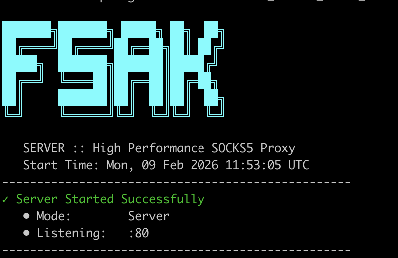
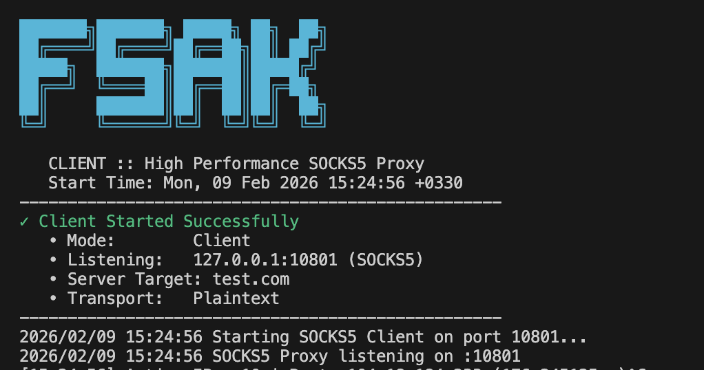

# FSAK - Fast Secure Awesome Kokh

[Persian (فارسی)](README_fa.md)

FSAK is a high-performance, secure SOCKS5 proxy server and client written in Go. It allows you to tunnel traffic securely between a client and a server, bypassing restrictions and ensuring privacy.

## Features

- **High Performance**: Built with Go for concurrency and speed.
- **SOCKS5 Support**: Standard SOCKS5 protocol support.
- **AES-256-CTR Encryption**: All traffic is encrypted with AES-256-CTR.
- **System Proxy**: Automatically configures system-wide proxy (all platforms in Proxy mode).
- **TUN Mode**: System-wide VPN tunnel (macOS only).
- **Cross-Platform**: Runs on Linux, Windows, macOS, and FreeBSD.
- **GUI Application**: Desktop app with profile management and one-click connect.
- **Address Pool**: Smart load balancing across multiple server addresses.
- **Easy Configuration**: JSON-based configuration.

## Download

Pre-built binaries are available from [GitHub Releases](../../releases).

### Available Builds

| Platform | CLI Client | CLI Server | GUI App |
|----------|------------|------------|---------|
| Linux (amd64) | ✅ | ✅ | ✅ |
| Linux (arm64) | ✅ | ✅ | ❌¹ |
| Windows (amd64) | ✅ | ✅ | ✅ |
| Windows (arm64) | ✅ | ✅ | ❌² |
| macOS (amd64) | ✅ | ✅ | ✅ |
| macOS (arm64) | ✅ | ✅ | ✅ |
| FreeBSD (amd64) | ✅ | ✅ | ❌ |

> **Notes:**
> ¹ Linux ARM64 GUI requires complex cross-compilation libraries (not available in CI).
> ² Windows ARM64 GUI has CGO/TUN2Socks compatibility issues.

## Installation

### Option 1: Download Pre-built Binaries

Download the appropriate binary for your platform from the [releases page](../../releases).

### Option 2: Build from Source

#### Prerequisites

- Go 1.25+ (for building from source)
- For Linux GUI: `libgl1-mesa-dev xorg-dev`

#### Building CLI Tools

```bash
# Clone the repository
git clone https://github.com/paulGUZU/fsak.git
cd fsak

# Build Client (current platform)
go build -o bin/fsak-client ./cmd/client

# Build Server (current platform)
go build -o bin/fsak-server ./cmd/server

# Cross-compile examples:
# Windows AMD64
GOOS=windows GOARCH=amd64 go build -o bin/fsak-client.exe ./cmd/client

# Linux ARM64
GOOS=linux GOARCH=arm64 go build -o bin/fsak-server-linux-arm64 ./cmd/server

# macOS (Universal - runs on both Intel and Apple Silicon)
GOOS=darwin GOARCH=amd64 go build -o bin/fsak-client-darwin ./cmd/client
```

#### Building GUI

```bash
# Linux (requires dependencies)
# sudo apt-get install -y libgl1-mesa-dev xorg-dev
go build -o bin/fsak-gui ./cmd/gui

# macOS
go build -o bin/fsak-gui ./cmd/gui

# Create macOS App Bundle
go install fyne.io/tools/cmd/fyne@latest
fyne package -os darwin -name FSAK -appID com.paulguzu.fsak.gui

# Windows (requires mingw)
go build -o bin/fsak-gui.exe ./cmd/gui
```

## Configuration

Both client and server use a `config.json` file.

### Example `config.json`

```json
{
  "addresses": [
    "1.1.1.1", 
    "2.2.2.0/24", 
    "3.3.3.3-4.4.4.4"
  ],
  "host": "your-cdn-host.com",
  "tls": false,
  "sni": "your-cdn-host.com",
  "port": 80,
  "proxy_port": 1080,
  "secret": "my-secret-key"
}
```

**Configuration Fields:**
- `addresses`: Server addresses (supports IP, CIDR ranges, and IP ranges)
- `host`: Host header / SNI for HTTP requests
- `tls`: Enable TLS encryption (requires `sni`)
- `sni`: Server Name Indication (required if TLS is enabled)
- `port`: Server listening port
- `proxy_port`: Local SOCKS5 port (client only)
- `secret`: Shared secret for encryption

> [!IMPORTANT]
> **CDN & Cloudflare Configuration:**
> - The connection between the **CDN** and your **Server** must be over **HTTP** (not HTTPS).
> - If you are using **Cloudflare**, you must set the SSL/TLS encryption mode to **Flexible**.

## Usage

### Running the Server

1. Create a `config.json` with the desired port and secret.
2. Run the server:

```bash
./bin/fsak-server -config config.json
```



### Running the Client (CLI)

1. Create a `config.json` with the server's address, the shared secret, and your desired local SOCKS5 port.
2. Run the client:

```bash
./bin/fsak-client -config config.json
```



3. The client will automatically configure system proxy on supported platforms (macOS, Linux, Windows).

### Running the Desktop GUI

The GUI is a native desktop app for Linux, macOS, and Windows.

```bash
./bin/fsak-gui
```

**GUI Features:**
- **Profile Management**: Save and manage multiple connection profiles
- **Connection Modes**:
  - **Proxy Mode**: SOCKS5 proxy with automatic system proxy configuration (all platforms)
  - **TUN Mode**: System-wide VPN tunnel (macOS only)
- **One-click Connect**: Easy start/stop with visual status indicator
- **Auto-proxy**: Automatically configures system proxy settings on connect

Profiles are stored locally in your OS config directory:
- macOS: `~/Library/Application Support/fsak/client_profiles.json`
- Linux: `~/.config/fsak/client_profiles.json`
- Windows: `%AppData%\fsak\client_profiles.json`

### Connection Modes

#### Proxy Mode (All Platforms)
- Runs a local SOCKS5 proxy on `127.0.0.1:proxy_port`
- Automatically configures system-wide proxy settings
- Supports macOS, Linux (GNOME/KDE), and Windows

#### TUN Mode (macOS Only)
- Creates a virtual network interface (`utun233`)
- Routes all system traffic through the VPN
- Requires administrator privileges

## Platform-Specific Notes

### macOS
- All features supported
- TUN mode requires admin privileges
- System proxy uses `networksetup`

### Linux
- System proxy supports GNOME, Unity, Cinnamon, Budgie, Pantheon, and KDE Plasma
- Uses `gsettings` or `kwriteconfig` for proxy configuration
- GUI requires OpenGL and X11 development libraries

### Windows
- System proxy configured via Registry
- Automatically notifies Windows of proxy changes
- No additional dependencies required

### FreeBSD
- CLI tools supported
- GUI not available (no Fyne support)

## License

MIT


## زنده باد ایران - به امید آزادی 
